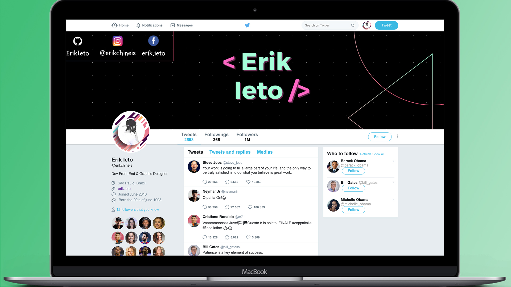

# Twitter - Layout

Developing a Twitter layout

<h1 align="center">
    
</h1>

  <a href="#-tecnologias">Tecnologias</a>&nbsp;&nbsp;&nbsp;|&nbsp;&nbsp;&nbsp;
  <a href="#-projeto">Projeto</a>&nbsp;&nbsp;&nbsp;|&nbsp;&nbsp;&nbsp;
  <a href="#-layout">Layout</a>&nbsp;&nbsp;&nbsp;|&nbsp;&nbsp;&nbsp;

 

## Tecnologias

Esse projeto foi desenvolvido utilizando as seguintes tecnologias:

- [HTML5](https://www.w3schools.com/html/)
- [CSS3](https://www.w3schools.com/css/)

## Projeto

Desenvolvendo o layout do Twitter com HTML5 e CSS3.
 

## Layout

  

 
 
 

  

 

---

Desenvolvido por Erik Ieto

